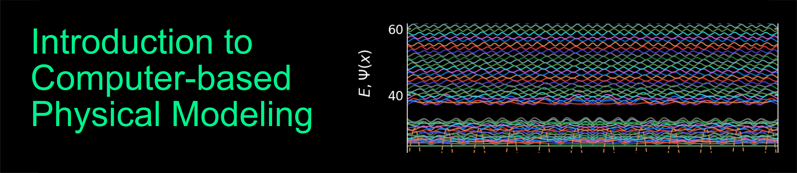

.. Experimental Physics 3 documentation master file, created by
   sphinx-quickstart on Tue Mar 31 12:45:28 2020.
   You can adapt this file completely to your liking, but it should at least
   contain the root `toctree` directive.

Welcome to the Introduction to Photonics 1!
========================================================================

Photonics is a field of science that is manipulating the flow of light. It contains many facets of research involving light propgation from fundamentals involving light matter interaction to applications involving photonic computing with disordered media or single light quanta to adaptive superresolution microscopy. It is one of the fastest growing fields. 

In this course we will introduce into the field of optics and photonics. We will start with simple but powerful descriptions of light propagation using ray optics to more advanced physics using electromagnetic waves. We will explore Fourier optics, anisotropic media and non-linear optics to lay the foundation to more complex topics in advanced lecture series. 

.. toctree::
   :maxdepth: 2
   :caption: Lecture 1:

   notebooks/L1/1_ray_optics.rst
   
Indices and tables
==================

* :ref:`genindex`
* :ref:`modindex`
* :ref:`search`
